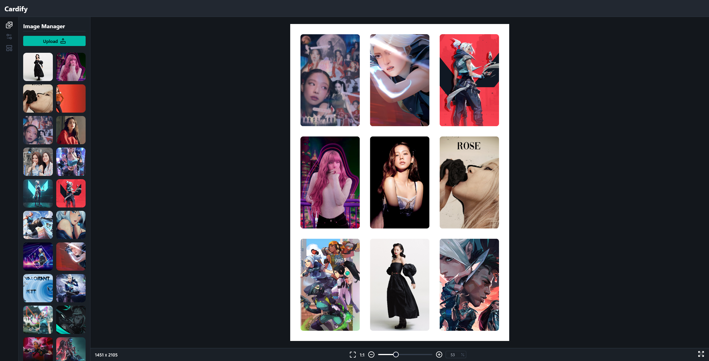
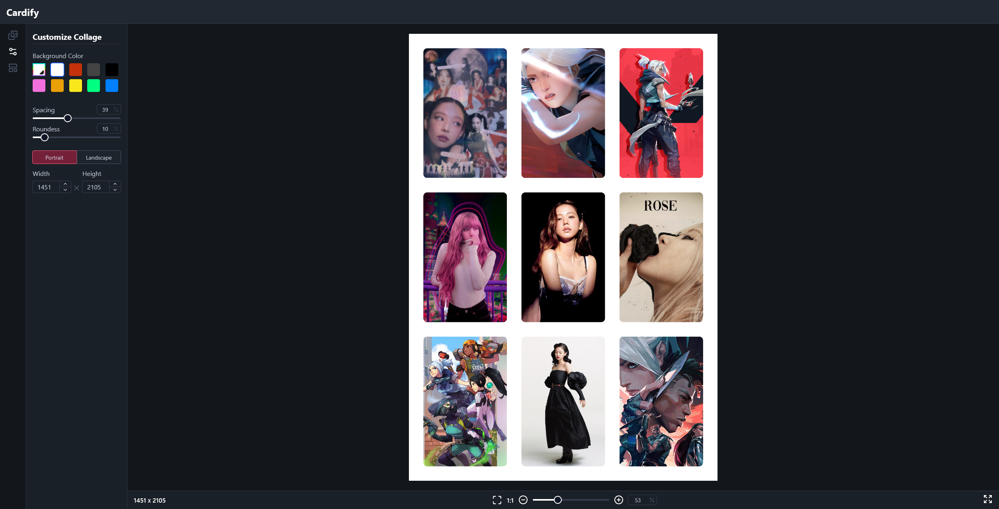
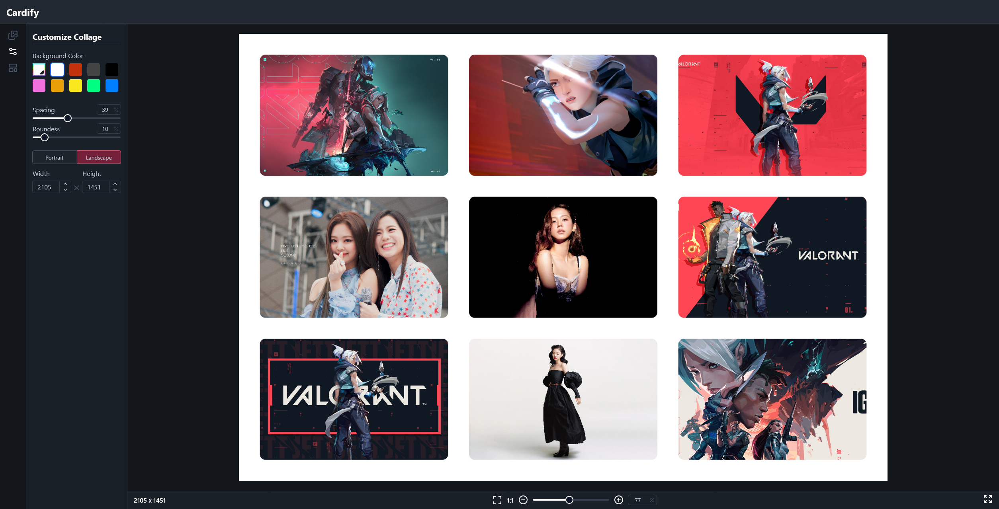
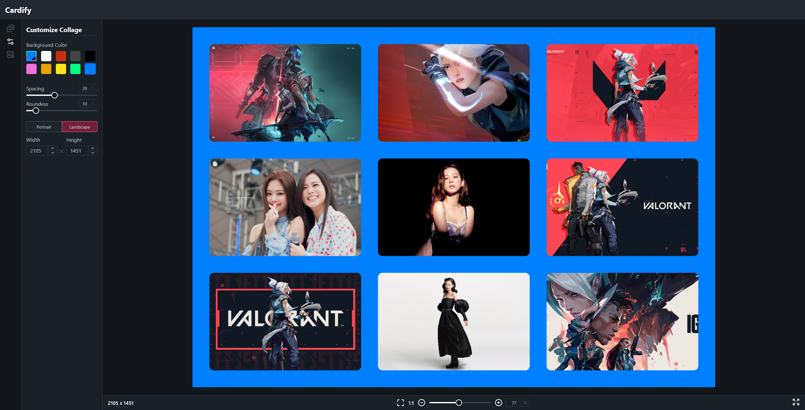

# CARDIFY

### Make your memories with cardify and hang it on your wall.

#### create image collages with simply dragging and dropping images.

### In Progress

### Here are some screenshots of the app!

#### CUSTOMIZE ACCORDINGLY

TO Run the app follow these steps:
NOTE:- The Collage Maker app is currently under development in the imageDevelopment branch
and has not been merged to main yet.

`git clone https://github.com/nidhish17/cardify.git`

`cd cardify`

`git checkout imageDevelopment` or `git switch imageDevelopment`

`git branch`
(you should see *imageDevelopment)

Run `npm install`

Now Run `npm run dev`

🎊 That's all ! 🎊